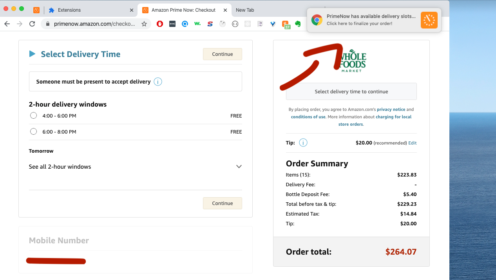

# PrimeNow Reloader
Tired of refreshing primenow in hopes of finding a delivery window? Me too. 

## Installation

1. Download this repo.
1. Open Chrome -> More Tools -> Extensions -> Load Unpacked Extension.
1. Select the downloaded repo

## Usage 
1. Visit primenow's checkout page (as shown in the screenshot below) and leave the tab open. Note: you can continue browsing other sites in different tabs
1. Wait till you receive a notification
1. Enjoy a beer 🍻

